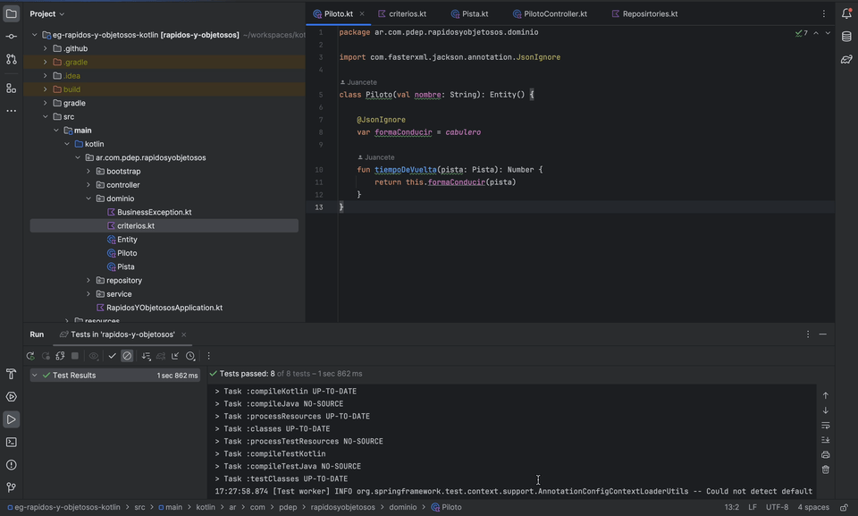

## Ejemplo Rápidos y objetosos

 

Resolución de parte del TP 2018 *rápidos y objetosos*. Se encuentra modelado en kotlin. Para esta solución se utilizó Spring boot. El resultado es una API que permite consultar la lista de pilotos y el tiempo por vuelta.

También se encuentra testeado tanto el modelo como los endpoints.

